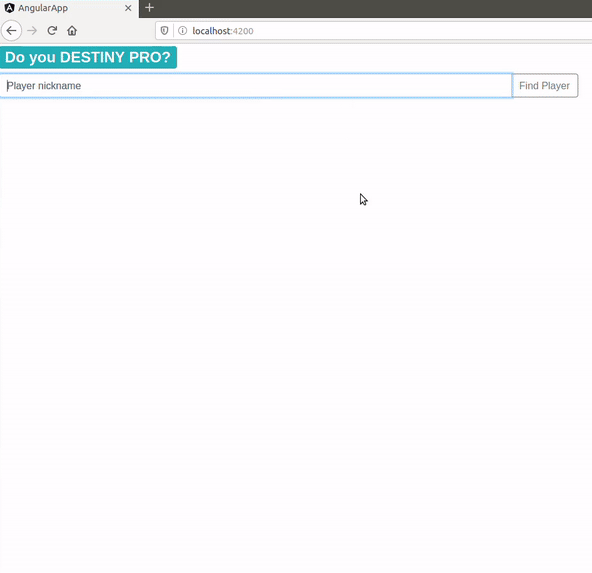

## **DO you Destiny PRO**
Searching application for Destiny 2 player. It presents basic statistics of a given player.

#### Motivation

Bungie.net allows users to create fireteams. Sometimes we can't determine the skill of the player who joins our team. That's why I decided to create an application that allows you to quickly check the player's general skills and statistics.

#### Features

[**Must have**](https://github.com/FAIRit/be-destinypro/issues?q=is%3Aissue+is%3Aclosed+label%3A%22must+have%22)

[**Nice to have**](https://github.com/FAIRit/be-destinypro/issues?q=is%3Aopen+is%3Aissue+label%3A%22nice+to+have%22)

#### Tech/framework used

SpringBoot, Hibernate, Docker, Angular

#### Installation

Needed: Docker

To run App locally, you need build project with docker-compose :

`$ docker-compose up -d`

#### How to use?

Open your browser on: localhost:4200

EXAMPLE PLAYER NICKNAME: akamre, katojido, malenkam, westersylwester

#### API Documentation

Endpoint documentation is available at https://bungie-net.github.io/multi/
